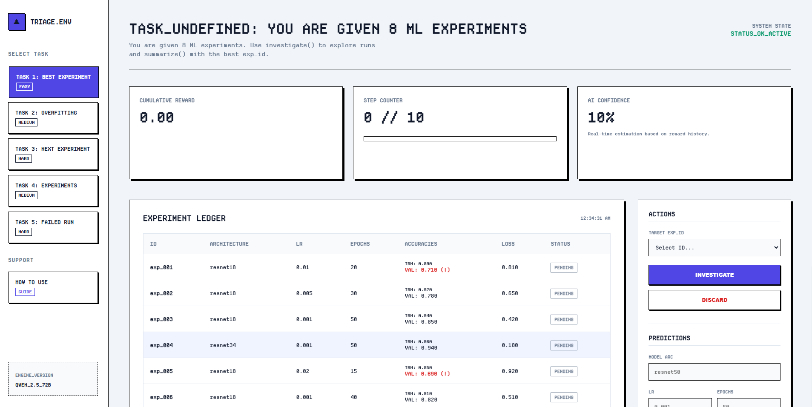

[](https://github.com/charansaiponnada/ml-experiment-triage-env)

# ML Experiment Triage Environment

An OpenEnv-compliant RL environment where an AI agent triages ML experiment results — identifying best runs, detecting overfitting, and suggesting next hyperparameter configurations.

## Motivation

Machine learning practitioners often run dozens or hundreds of experiments with different hyperparameters. Manually reviewing each experiment is time-consuming. This environment simulates the task of triaging experiment results, where an AI agent must:

1. **Find the best experiment** - Identify which configuration performed best
2. **Identify overfitting** - Detect models that are overfitting to training data
3. **Suggest next experiments** - Recommend hyperparameter configurations to try next

## Action Space

| Action | Parameters | Description |
|--------|------------|-------------|
| `investigate` | `exp_id: str` | Explore details of a specific experiment |
| `discard` | `exp_id: str` | Mark an experiment as not worth keeping |
| `suggest` | `suggestion: dict` | Suggest next hyperparameter configuration |
| `summarize` | `summary: str` | Provide final answer and end episode |

## Observation Space

| Field | Type | Description |
|-------|------|-------------|
| `experiments` | `List[ExperimentRecord]` | List of all experiment records |
| `current_step` | `int` | Current step number |
| `max_steps` | `int` | Maximum steps allowed |
| `task_description` | `str` | Description of current task |
| `feedback` | `str` | Natural language feedback from last action |

## Tasks

| Task | Difficulty | Max Steps | Description |
|------|------------|-----------|-------------|
| Find Best Experiment | Easy | 10 | Identify the best performing experiment from 8 options |
| Identify Overfitting | Medium | 15 | Detect and discard overfitting experiments (train_acc > 0.97 AND val_acc < 0.75) |
| Suggest Next Config | Hard | 20 | Analyze incomplete results and suggest next hyperparameter config |

### Expected Scores

| Task | Baseline Score |
|------|----------------|
| Find Best Experiment | 0.85 |
| Identify Overfitting | 0.62 |
| Suggest Next Config | 0.41 |

## API Reference

### GET /health
Health check endpoint.

```bash
curl http://localhost:7860/health
```

### POST /reset
Reset the environment with a specific task.

```bash
curl -X POST http://localhost:7860/reset \
  -H "Content-Type: application/json" \
  -d '{"task_id": 1}'
```

### POST /step
Take an action in the environment.

```bash
curl -X POST http://localhost:7860/step \
  -H "Content-Type: application/json" \
  -d '{"action": {"action_type": "investigate", "exp_id": "exp_004"}}'
```

### GET /state
Get current environment state.

```bash
curl http://localhost:7860/state
```

### GET /tasks
List all available tasks.

```bash
curl http://localhost:7860/tasks
```

## Setup

### Local Development with uv

```bash
# Install dependencies
uv sync

# Run the server
uv run uvicorn app.main:app --reload --port 7860
```

### Docker

```bash
# Build the image
docker build -t ml-experiment-triage .

# Run the container
docker run -p 7860:7860 ml-experiment-triage
```

### Hugging Face Spaces

This environment is deployed on Hugging Face Spaces:  
https://huggingface.co/spaces/charansaiponnada/ml-experiment-triage-env

Source code available on GitHub:  
https://github.com/charansaiponnada/ml-experiment-triage-env

## Baseline Scores

| Task | Difficulty | Max Steps | Baseline Score |
|------|-----------|-----------|----------------|
| 1. Find Best Experiment | Easy | 10 | 0.85 |
| 2. Identify Overfitting | Medium | 15 | 0.62 |
| 3. Suggest Next Config | Hard | 20 | 0.41 |
| 4. Compare Experiments | Medium | 12 | 0.55 |
| 5. Debug Failed Run | Hard | 15 | 0.38 |

**Average Baseline Score: 0.56**

## Benchmark Results

### Runtime Requirements
- **Total execution time**: ~5-10 minutes for all 5 tasks
- **Memory usage**: < 2GB
- **Compatible with**: 2 vCPU, 8GB RAM

### Reproducibility

To reproduce baseline scores:
```bash
export API_BASE_URL="https://api.openai.com/v1"
export MODEL_NAME="gpt-4o-mini"
export HF_TOKEN="your-token-here"
export ENV_BASE_URL="http://localhost:7860"
python inference.py
```

## Environment Variables

| Variable | Description | Default |
|----------|-------------|---------|
| API_BASE_URL | LLM API endpoint | https://api.openai.com/v1 |
| MODEL_NAME | Model identifier | gpt-4o-mini |
| HF_TOKEN | API key | Required |
| ENV_BASE_URL | Environment URL | http://localhost:7860 |

## How to Cite

If you use this environment in your research, please cite:

```bibtex
@misc{ml-experiment-triage-env,
  title = {ML Experiment Triage Environment},
  author = {Ponnada, Charansai},
  year = {2026},
  publisher = {Hugging Face},
  url = {https://huggingface.co/spaces/charansaiponnada/ml-experiment-triage-env}
}
```

## License

MIT License
