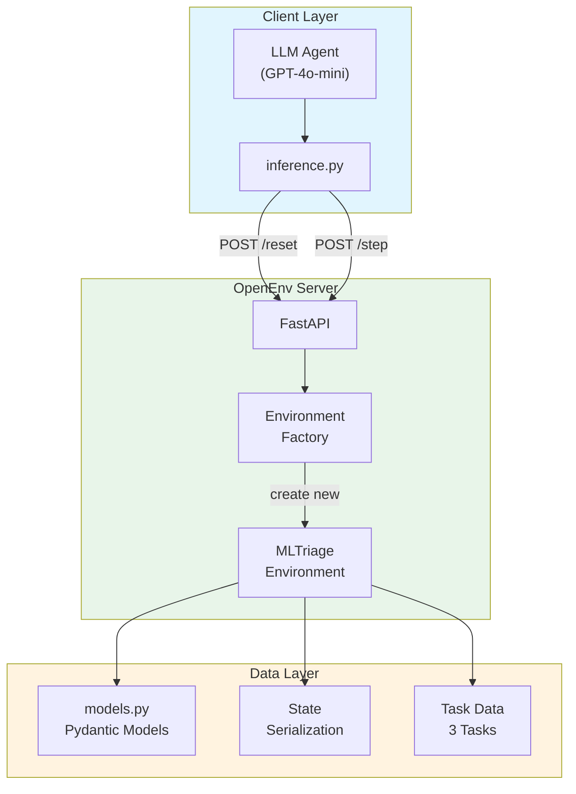
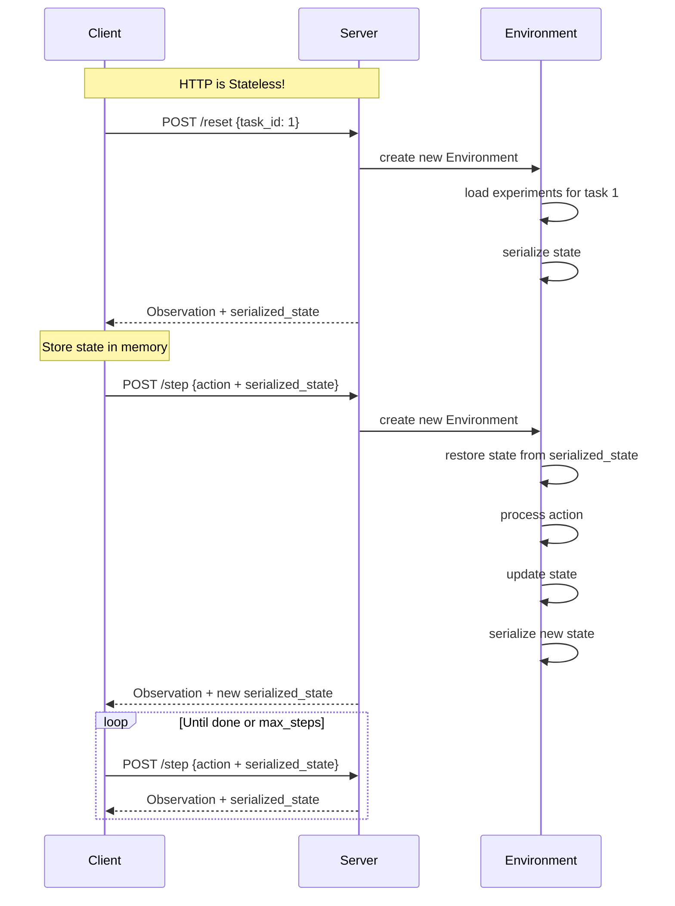
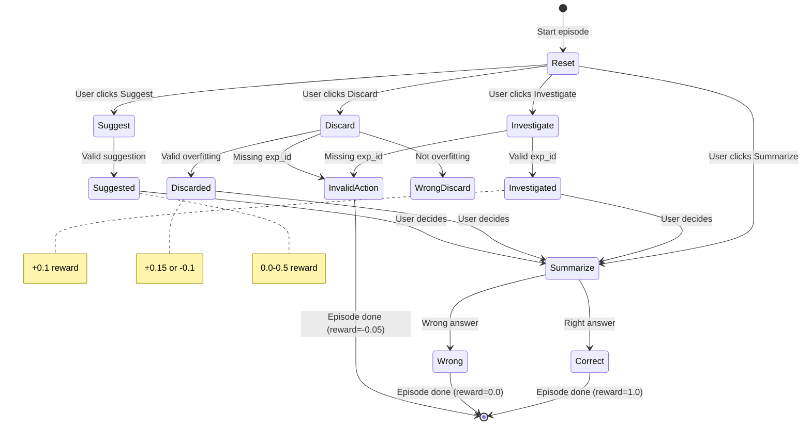
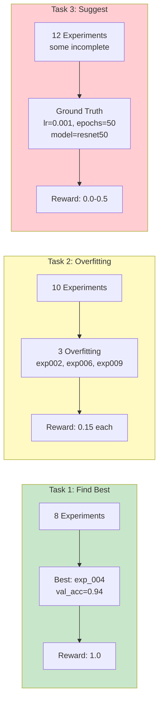
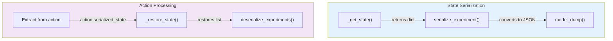

```mermaid
flowchart TD
    subgraph Client["Client Layer"]
        LLM["LLM Agent<br/>(GPT-4o-mini)"]
        Inf["inference.py"]
    end
    
    subgraph Server["OpenEnv Server"]
        API["FastAPI<br/Endpoints"]
        EnvFact["Environment<br/>Factory"]
        Env["MLTriage<br/>Environment"]
    end
    
    subgraph Data["Data Layer"]
        Models["models.py<br/>Pydantic Models"]
        State["State<br/>Serialization"]
        Tasks["Task Data<br/>3 Tasks"]
    end
    
    LLM --> Inf
    Inf -->|"POST /reset"| API
    Inf -->|"POST /step"| API
    API --> EnvFact
    EnvFact -->|"create new"| Env
    Env --> Models
    Env --> State
    Env --> Tasks
    
    style Client fill:#e1f5fe
    style Server fill:#e8f5e9
    style Data fill:#fff3e0
```

```mermaid
sequenceDiagram
    participant C as Client
    participant S as Server
    participant E as Environment
    
    Note over C,S: HTTP is Stateless!
    
    C->>S: POST /reset {task_id: 1}
    S->>E: create new Environment
    E->>E: load experiments for task 1
    E->>E: serialize state
    S-->>C: Observation + serialized_state
    
    Note over C: Store state in memory
    
    C->>S: POST /step {action + serialized_state}
    S->>E: create new Environment
    E->>E: restore state from serialized_state
    E->>E: process action
    E->>E: update state
    E->>E: serialize new state
    S-->>C: Observation + new serialized_state
    
    loop Until done or max_steps
        C->>S: POST /step {action + serialized_state}
        S-->>C: Observation + serialized_state
    end
```

```mermaid
stateDiagram-v2
    [*] --> Reset: Start episode
    
    Reset --> Investigate: User clicks Investigate
    Reset --> Discard: User clicks Discard
    Reset --> Suggest: User clicks Suggest
    Reset --> Summarize: User clicks Summarize
    
    Investigate --> Investigated: Valid exp_id
    Investigate --> InvalidAction: Missing exp_id
    
    Discard --> Discarded: Valid overfitting
    Discard --> WrongDiscard: Not overfitting
    Discard --> InvalidAction: Missing exp_id
    
    Suggest --> Suggested: Valid suggestion
    
    Investigated --> Summarize: User decides
    Discarded --> Summarize: User decides
    Suggested --> Summarize: User decides
    
    Summarize --> Correct: Right answer
    Summarize --> Wrong: Wrong answer
    
    Correct --> [*]: Episode done (reward=1.0)
    Wrong --> [*]: Episode done (reward=0.0)
    InvalidAction --> [*]: Episode done (reward=-0.05)
    
    note right of Investigated: +0.1 reward
    note right of Discarded: +0.15 or -0.1
    note right of Suggested: 0.0-0.5 reward
```

```mermaid
flowchart LR
    subgraph Task1["Task 1: Find Best"]
        T1A["8 Experiments"]
        T1B["Best: exp_004<br/>val_acc=0.94"]
        T1C["Reward: 1.0"]
    end
    
    subgraph Task2["Task 2: Overfitting"]
        T2A["10 Experiments"]
        T2B["3 Overfitting<br/>exp002, exp006, exp009"]
        T2C["Reward: 0.15 each"]
    end
    
    subgraph Task3["Task 3: Suggest"]
        T3A["12 Experiments<br/>some incomplete"]
        T3B["Ground Truth<br/>lr=0.001, epochs=50<br/>model=resnet50"]
        T3C["Reward: 0.0-0.5"]
    end
    
    T1A --> T1B --> T1C
    T2A --> T2B --> T2C
    T3A --> T3B --> T3C
    
    style Task1 fill:#c8e6c9
    style Task2 fill:#fff9c4
    style Task3 fill:#ffcdd2
```

```mermaid
flowchart TB
    subgraph Serialization["State Serialization"]
        S1["_get_state()"]
        S2["serialize_experiment()"]
        S3["model_dump()"]
    end
    
    subgraph Action["Action Processing"]
        A1["Extract from action"]
        A2["_restore_state()"]
        A3["deserialize_experiments()"]
    end
    
    S1 -->|"returns dict"| S2 -->|"converts to JSON"| S3
    A1 -->|"action.serialized_state"| A2 -->|"restores list"| A3
    
    style Serialization fill:#e3f2fd
    style Action fill:#f3e5f5
```

```mermaid
flowchart LR
    subgraph Input["Input"]
        I1["task_id: int"]
        I2["action_type: str"]
        I3["exp_id: str"]
        I4["suggestion: dict"]
    end
    
    subgraph Validation["Validation"]
        V1["Pydantic Model"]
        V2["Type Check"]
        V3["Required Fields"]
    end
    
    subgraph Processing["Processing"]
        P1["Environment.step()"]
        P2["Apply Action"]
        P3["Calculate Reward"]
    end
    
    subgraph Output["Output"]
        O1["MLTriageObservation"]
        O2["reward: float"]
        O3["done: bool"]
    end
    
    Input --> Validation --> Processing --> Output
    
    style Validation fill:#bbdefb
    style Processing fill:#c8e6c9
    style Output fill:#f8bbd0
```
